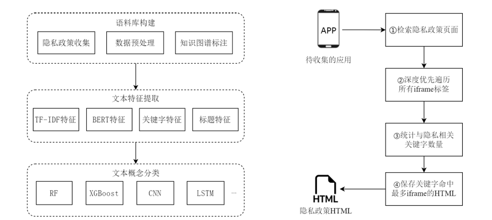

# Privacy Policy Compliance Detection and Analysis Based on Knowledge Graph


## Introduction

This is the official repository of Privacy Policy Compliance Detection and Analysis
Based on Knowledge Graph


The Personal Information Protection Law (PIPL) served as an important legal framework for safeguarding personal information rights. In order to analyze the compliance of privacy policies with respect to PIPL, we presented an intelligent method for assessing privacy policy compliance based on a knowledge graph. we've introduced a multi-level privacy policy knowledge graph that covered concepts related to information protection that needed to be explained in privacy policies, a corpus of labeled policies with hierarchy called APPCP-100 and Chinese concept classifiers to achieve efficient detection of privacy policy compliance. This repository contains our proposed knowledge graph, corpus, and all code used in the study.




## Project Directory Structure
```shell
|-- code # Contains all the code used in the paper
|   |-- pipeline # The pipeline from HTML crawling to compliance checking
|       |-- auto_html_save_zh.py # Automatically saves HTML
|       |-- bodyExtraction.py # Extracts the body of HTML
|       |-- title_filter.py # Filter the titles of HTML
|       |-- xmlConvertion.py # Converts HTML to XML
|       |-- ETtrees # Model used to classify paragraphs and titles

|   |-- train # Contains training code used in the paper
|       |-- tfidf_embeddings.py # Generates TF-IDF embeddings
|       |-- bert_embeddings.py # Generates BERT embeddings
|       |-- bert_finetuning.py # Fine-tunes BERT to get better embeddings
|       |-- get_all_f1_roc_acc.py # Computes metrics (F1 score, ROC, accuracy) on the test dataset for trained models
|       |-- classifier_compare.py # Compares the performance of different classifiers

|-- data  # Contains data used and generated
|   |-- APPCP-100 # Our proposed corpus
|       |-- xml files # 100 labeled privacy policies with hierarchy 
|   |-- keywords.txt # Keyword list for each of the 96 concepts in PIPL knowledge graph
|   |-- PIPL_knowledgegraph.png # PIPL knowledge graph
```

## Requirements

We have tested all the code in this repository on a server with the following configuration:
- CPU: Intel(R) Xeon(R) CPU E5-2640 v3
- GPU: Tesla M40
- OS: Ubuntu 20.04

The code of this repository is written in Python. We use conda to manage the Python dependencies. Please download and install conda first.

After cloning this repository, change the working directory to the cloned directory.

We recommend using Python version 3.8 or higher. Create a new conda environment named 'pp' and install the dependencies:

```
conda create -n pp python=3.8
```

Navigate to the 'code' directory and install the required packages:

```
cd code
pip install -r requirements.txt
```

## Training and Testing Models

###  Step1: Preparaion

Divide the training and test sets based on the APPCP-100 XML files. Navigate to the train folder to download the BERT model for later use.

### Step2: Generate Embeddings

Fine-tune the privbert model using the training datasets:

```
python bert_finetune.py
```

Refer to the logfile to select the best fine-tuned model and update the path in the 'bert_embeddings.py' file.

Generate tfidf and privbert embeddings for the training and testing datasets.

```
python tfidf_embeddings.py
python bert_embeddings.py
```

### Step3: Train & Test
Choose classifiers and evaluate it using the embeddings from Step 2.

Example code selects the following classifiers: XGBoost, Random Forest, Extra Trees (ET), Gaussian Naive Bayes (GNB), K-Nearest Neighbors (KNN), Logistic Regression (LR), Decision Tree (DT), and Support Vector Machine (SVM).

```
python classifiers_compare.py
```
